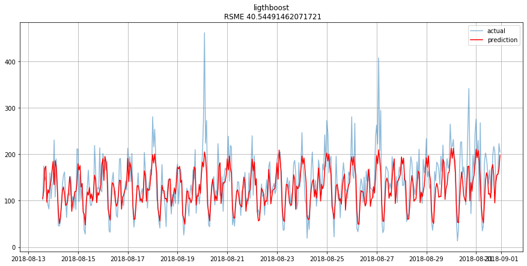

# Research project "Predict taxi orders next hour"

## Description
We have historical data about order taxi in airport. We need predict how many orders will next hour, to attract more drivers during rush hours. We have a metric limit RSME=48.  

## Main features
* Time series analise

* Feature importance

* Select best model

## Files
* russian version  
* english version
